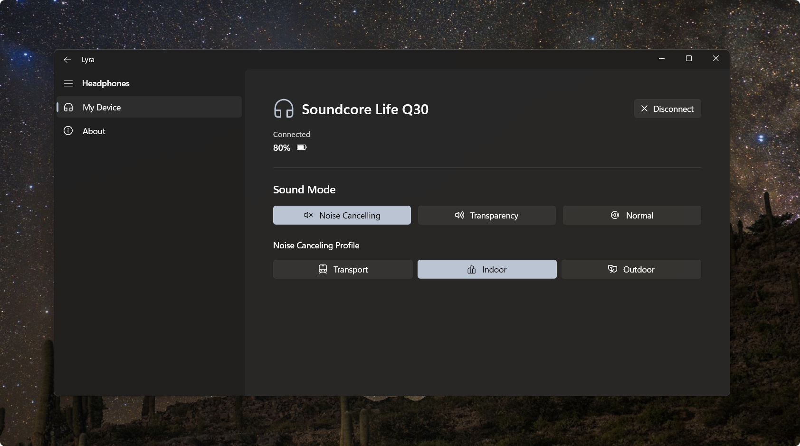

# Lyra

WinUI 3 application to control Soundcore devices using [Oppzippy/OpenSCQ30][1].

## Features

- [x] Ambient sound mode
- [x] Noise cancelling mode
- [x] Basic stats (battery, connection status, etc.)
- [x] Auto connect to previously connected devices
- [ ] EQ settings

## Supported devices

Lyra uses [Oppzippy/OpenSCQ30][1] to communicate with Soundcore devices. You can find a list of supported devices on the here: [Supported Devices](https://github.com/Oppzippy/OpenSCQ30?tab=readme-ov-file#supported-devices).

## Acknowledgements

- [Oppzippy/OpenSCQ30][1] for providing the underlying communication with Soundcore devices.

[1]: https://github.com/Oppzippy/OpenSCQ30